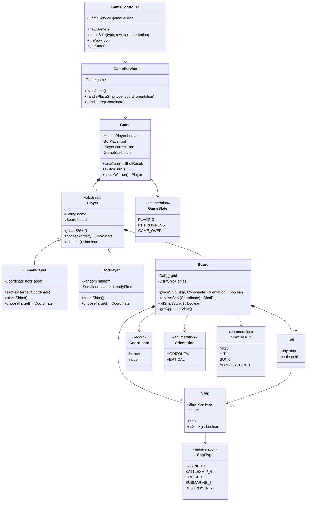

# Battleship class diagram

```mermaid
classDiagram
  class GameController {
    -GameService gameService
    +newGame()
    +placeShip(type, row, col, orientation)
    +fire(row, col)
    +getState()
  }
  class GameService {
    -Game game
    +startGame()
    +handlePlaceShip(type, coord, orientation)
    +handleFire(Coordinate)
  }
  class Game {
    -HumanPlayer human
    -BotPlayer bot
    -Player currentTurn
    -GameState state
    +takeTurn() ShotResult
    +switchTurn()
    +checkWinner() Player
  }
  class Player {
    <<abstract>>
    #String name
    #Board board
    +placeShips()*
    +chooseTarget() Coordinate*
    +hasLost() boolean
  }
  class HumanPlayer {
    -Coordinate nextTarget
    +setNextTarget(Coordinate)
    +placeShips()
    +chooseTarget() Coordinate
  }
  class BotPlayer {
    -Random random
    -Set~Coordinate~ alreadyFired
    +placeShips()
    +chooseTarget() Coordinate
  }
  class Board {
    -Cell[][] grid
    -List~Ship~ ships
    +placeShip(Ship, Coordinate, Orientation) boolean
    +receiveShot(Coordinate) ShotResult
    +allShipsSunk() boolean
    +getOpponentView()
  }
  class Cell {
    -Ship ship
    -boolean hit
  }
  class Ship {
    -ShipType type
    -int hits
    +hit()
    +isSunk() boolean
  }
  class Coordinate {
    <<record>>
    int row
    int col
  }
  class ShipType {
    <<enumeration>>
    CARRIER_5
    BATTLESHIP_4
    CRUISER_3
    SUBMARINE_3
    DESTROYER_2
  }
  class Orientation {
    <<enumeration>>
    HORIZONTAL
    VERTICAL
  }
  class GameState {
    <<enumeration>>
    PLACING
    IN_PROGRESS
    GAME_OVER
  }
  class ShotResult {
    <<enumeration>>
    MISS
    HIT
    SUNK
    ALREADY_FIRED
  }
  GameController --> GameService
  GameService --> Game
  Game *-- "2" Player
  Player <|-- HumanPlayer
  Player <|-- BotPlayer
  Player *-- Board
  Board *-- "100" Cell
  Board *-- "5" Ship
  Cell --> "0..1" Ship
  Ship --> ShipType
  Game --> GameState
  Board ..> Coordinate
  Board ..> Orientation
  Board ..> ShotResult
```
