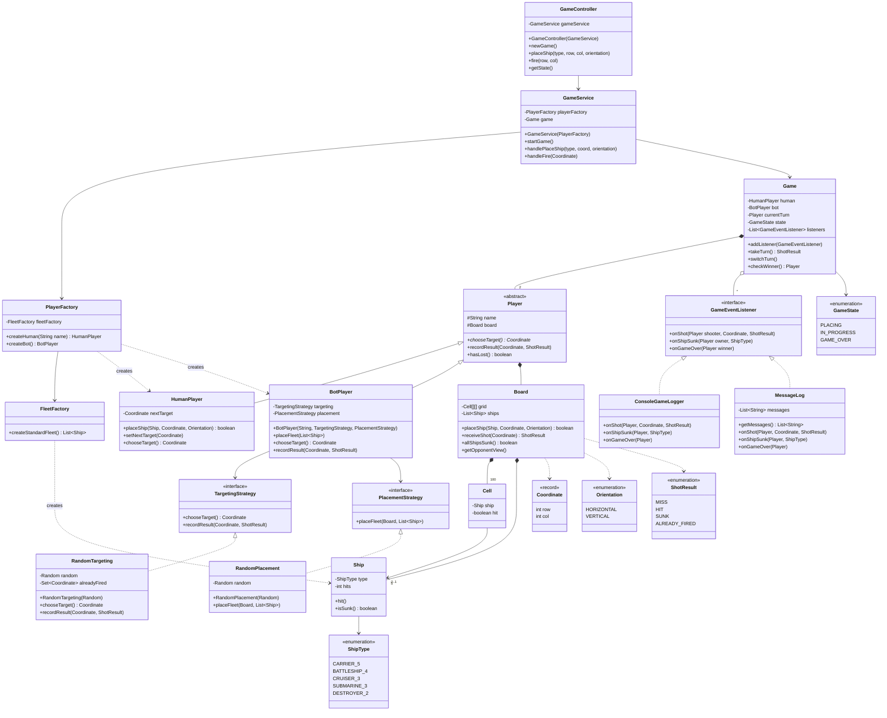

# Battleship class diagram

```mermaid
classDiagram
  %% ---------- Spring layer ----------
  class GameController {
    -GameService gameService
    +GameController(GameService)
    +newGame()
    +placeShip(type, row, col, orientation)
    +fire(row, col)
    +getState()
  }
  class GameService {
    -PlayerFactory playerFactory
    -Game game
    +GameService(PlayerFactory)
    +startGame()
    +handlePlaceShip(type, coord, orientation)
    +handleFire(Coordinate)
  }

  %% ---------- Factory pattern ----------
  class PlayerFactory {
    -FleetFactory fleetFactory
    +createHuman(String name) HumanPlayer
    +createBot() BotPlayer
  }
  class FleetFactory {
    +createStandardFleet() List~Ship~
  }

  %% ---------- Core game ----------
  class Game {
    -HumanPlayer human
    -BotPlayer bot
    -Player currentTurn
    -GameState state
    -List~GameEventListener~ listeners
    +addListener(GameEventListener)
    +takeTurn() ShotResult
    +switchTurn()
    +checkWinner() Player
  }
  class Player {
    <<abstract>>
    #String name
    #Board board
    +chooseTarget() Coordinate*
    +recordResult(Coordinate, ShotResult)
    +hasLost() boolean
  }
  class HumanPlayer {
    -Coordinate nextTarget
    +placeShip(Ship, Coordinate, Orientation) boolean
    +setNextTarget(Coordinate)
    +chooseTarget() Coordinate
  }
  class BotPlayer {
    -TargetingStrategy targeting
    -PlacementStrategy placement
    +BotPlayer(String, TargetingStrategy, PlacementStrategy)
    +placeFleet(List~Ship~)
    +chooseTarget() Coordinate
    +recordResult(Coordinate, ShotResult)
  }

  %% ---------- Strategy pattern ----------
  class TargetingStrategy {
    <<interface>>
    +chooseTarget() Coordinate
    +recordResult(Coordinate, ShotResult)
  }
  class RandomTargeting {
    -Random random
    -Set~Coordinate~ alreadyFired
    +RandomTargeting(Random)
    +chooseTarget() Coordinate
    +recordResult(Coordinate, ShotResult)
  }
  class PlacementStrategy {
    <<interface>>
    +placeFleet(Board, List~Ship~)
  }
  class RandomPlacement {
    -Random random
    +RandomPlacement(Random)
    +placeFleet(Board, List~Ship~)
  }

  %% ---------- Observer pattern ----------
  class GameEventListener {
    <<interface>>
    +onShot(Player shooter, Coordinate, ShotResult)
    +onShipSunk(Player owner, ShipType)
    +onGameOver(Player winner)
  }
  class ConsoleGameLogger {
    +onShot(Player, Coordinate, ShotResult)
    +onShipSunk(Player, ShipType)
    +onGameOver(Player)
  }
  class MessageLog {
    -List~String~ messages
    +getMessages() List~String~
    +onShot(Player, Coordinate, ShotResult)
    +onShipSunk(Player, ShipType)
    +onGameOver(Player)
  }

  %% ---------- Board model ----------
  class Board {
    -Cell[][] grid
    -List~Ship~ ships
    +placeShip(Ship, Coordinate, Orientation) boolean
    +receiveShot(Coordinate) ShotResult
    +allShipsSunk() boolean
    +getOpponentView()
  }
  class Cell {
    -Ship ship
    -boolean hit
  }
  class Ship {
    -ShipType type
    -int hits
    +hit()
    +isSunk() boolean
  }
  class Coordinate {
    <<record>>
    int row
    int col
  }

  %% ---------- Enums ----------
  class ShipType {
    <<enumeration>>
    CARRIER_5
    BATTLESHIP_4
    CRUISER_3
    SUBMARINE_3
    DESTROYER_2
  }
  class Orientation {
    <<enumeration>>
    HORIZONTAL
    VERTICAL
  }
  class GameState {
    <<enumeration>>
    PLACING
    IN_PROGRESS
    GAME_OVER
  }
  class ShotResult {
    <<enumeration>>
    MISS
    HIT
    SUNK
    ALREADY_FIRED
  }

  %% ---------- Relationships ----------
  GameController --> GameService
  GameService --> PlayerFactory
  GameService --> Game
  PlayerFactory --> FleetFactory
  PlayerFactory ..> HumanPlayer : creates
  PlayerFactory ..> BotPlayer : creates
  FleetFactory ..> Ship : creates

  Game *-- "2" Player
  Game o-- "*" GameEventListener
  Game --> GameState
  Player <|-- HumanPlayer
  Player <|-- BotPlayer
  Player *-- Board

  BotPlayer --> TargetingStrategy
  BotPlayer --> PlacementStrategy
  TargetingStrategy <|.. RandomTargeting
  PlacementStrategy <|.. RandomPlacement

  GameEventListener <|.. ConsoleGameLogger
  GameEventListener <|.. MessageLog

  Board *-- "100" Cell
  Board *-- "5" Ship
  Cell --> "0..1" Ship
  Ship --> ShipType
  Board ..> Coordinate
  Board ..> Orientation
  Board ..> ShotResult
```
